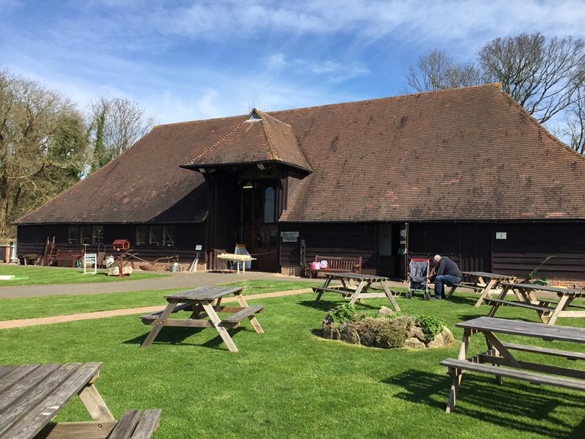

<p align="center">
  <a href="">
    
  </a>
</p>
<h1 align="center">
  Elham Valley Line Trust
</h1>

## Description

A website project donated to The Elham Valley Line Trust which was formed in 1984 to preserve railway history, countryside crafts and to provide educational facilities.

## Build tooling

Uses Gulp for Sass + JS compilation and browsersync, but is otherwise a simple 'traditional' WP boilerplate ie. no build processes for working with React-based Gutenberg blocks (this theme uses ACF for custom block creation), and no Bedrock or other Composer-based PHP dependency management. 
```sh
cd app/public/wp-content/themes/dan-develops-wp/build
npm install
gulp
```

## Docs

Coming soon

## Requirements

Gulp process is currently using node v11.6.0 (npm v6.9.0)

